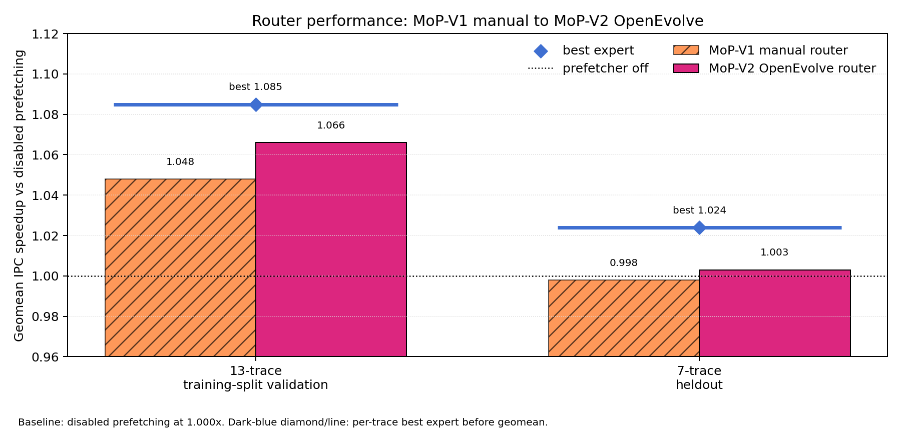
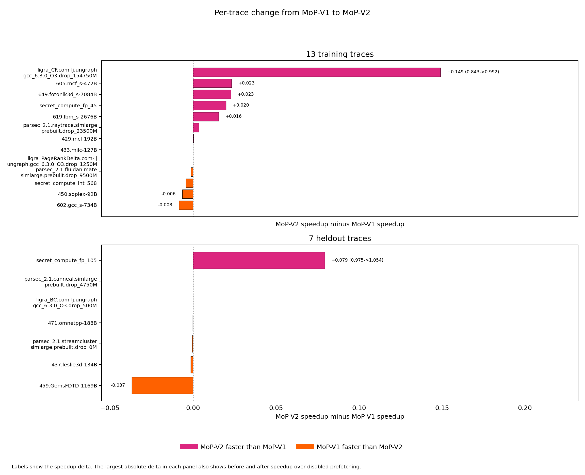
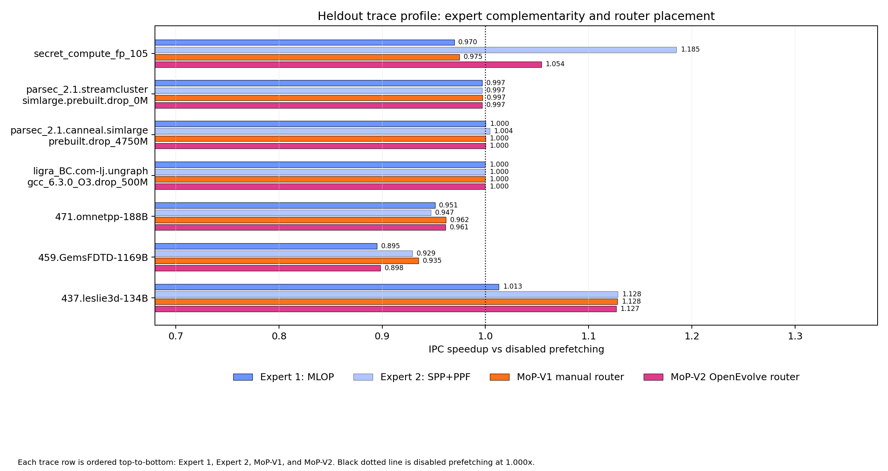
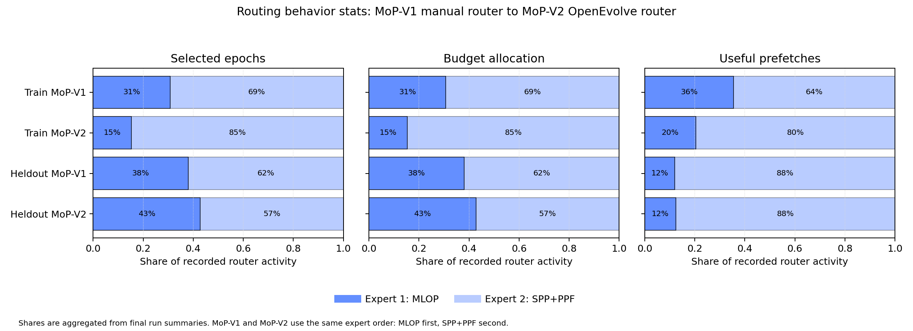
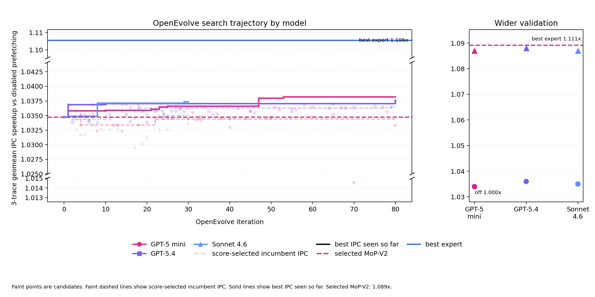

# Mixture-of-Prefetchers

## 0. Abstract

Modern hardware prefetchers improve cache behavior by fetching data before a core asks for it. A single prefetcher can work well on some programs and poorly on others, so our project asks whether a small router can choose between two existing L2-cache prefetchers and reduce these mismatches.

We built a two-expert router on top of Athena. The router chooses between `MLOP` and `SPP+PPF`, two Athena L2-cache prefetchers, using counters from recent execution epochs. We then used OpenEvolve to tune a compact policy dictionary for the router. The final public names are simple: `MoP-V1` is the manual one-probe router, and `MoP-V2` is the OpenEvolve-tuned router.

All performance numbers use disabled prefetching as `1.000x`. On 13 training-validation traces, `MoP-V1` reaches `1.048x`, `MoP-V2` reaches `1.066x`, and the per-trace best expert reaches `1.085x`. On 7 heldout traces evaluated after policy selection, `MoP-V2` reaches `1.003x`, while the best expert reaches `1.024x`. The heldout gain is modest, and the training-validation result shows the main benefit: OpenEvolve improved the manual router, reduced tail losses, and moved the router closer to the stronger expert while keeping the same small routing idea.



*Caption: disabled prefetching is the black `1.000x` baseline. Dark blue marks the per-trace best expert. Orange is `MoP-V1`, the manual router. Pink is `MoP-V2`, the OpenEvolve-tuned router. Error bars are omitted here to keep the overview readable. The full table reports the trace-bootstrap intervals.*

## 1. Introduction

Cache misses are expensive because the processor waits for data from lower memory levels. Hardware prefetchers reduce this cost by predicting future memory accesses. The challenge is that memory access patterns vary across programs. A stream-like workload may favor a simple offset prefetcher, while a pointer-heavy or path-like workload may favor a signature or path prefetcher. A fixed prefetcher loses performance when it cannot adapt to these patterns.

Our project focuses on the L2 cache prefetcher in Athena. We study a narrow question:

**Can a lightweight router between two existing L2-cache prefetchers improve over disabled prefetching and move closer to the best expert on each trace?**

Our approach is grounded in a practical implementation. We build on a simulator and existing prefetchers, then add the routing framework, the OpenEvolve search setup, and an evaluation that keeps disabled prefetching as the universal `1.000x` baseline.

The final expert pair is `MLOP + SPP+PPF`. This pair gives a useful routing problem. On the 13 training-validation traces, `MLOP` wins 4 traces and `SPP+PPF` wins 9 traces. Both experts can beat disabled prefetching on several traces, and their strengths differ enough for a router to matter.

## 2. Related Work

`MLOP` is the Multi-Lookahead Offset Prefetcher from the 2019 Data Prefetching Championship 3. It evaluates offsets across multiple lookahead distances and keeps the offsets that predict future memory accesses well. In our project, `MLOP` acts as the offset-style expert. It is simple, strong, and available in Athena. The original DPC3 writeup is here: [Multi-Lookahead Offset Prefetcher](https://dpc3.compas.cs.stonybrook.edu/pdfs/Multi_lookahead.pdf).

`SPP+PPF` combines the Signature Path Prefetcher idea with a perceptron-based filter. Signature/path prefetching tracks recent address deltas under a compact signature and predicts likely next deltas. The perceptron filter scores candidate prefetches so the prefetcher can issue useful requests more aggressively while filtering lower-value ones. The DPC3 writeup is here: [Enhancing Signature Path Prefetching with Perceptron Based Prefetch Filtering](https://dpc3.compas.cs.stonybrook.edu/pdfs/Enhancing_signature.pdf).

Athena already contains these expert implementations and router baselines. Our work adds a controlled two-expert router and an OpenEvolve evaluator around Athena. The baselines we compare against are:

| Baseline or reference | Meaning |
| --- | --- |
| Disabled prefetching | Universal `1.000x` IPC baseline |
| `MLOP` | Fixed Expert 1 |
| `SPP+PPF` | Fixed Expert 2 |
| Best expert | Per-trace `max(MLOP, SPP+PPF)` |
| Worse expert | Per-trace `min(MLOP, SPP+PPF)` |
| `WinnerTakeAll` | Simple router that picks the stronger recent expert |
| `OneShotFit` | Simple router that probes once, then keeps the early winner |
| Athena MAB | Athena multi-armed-bandit router baseline |

The best expert is an upper reference from the two fixed experts. It is useful because it shows the maximum possible result for this two-expert pair under perfect per-trace selection.

## 3. Method

We implemented a router in Athena's L2-cache prefetching path. The router sees two existing experts, `MLOP` and `SPP+PPF`. It records per-expert counters for issued prefetches, useful prefetches, selected epochs, budget share, and traffic. Every epoch, it scores the recent behavior and chooses the next epoch's action.

An epoch is `500K` retired instructions. Retired instructions are instructions that complete at the simulated core. `MoP-V1` observes one full epoch with both experts available, then picks the higher-scoring expert for later epochs. `MoP-V2` keeps the same idea and changes only the policy constants that decide budget, scoring, and close-score behavior.

The public router names are:

| Public name | Meaning |
| --- | --- |
| `MoP-V1` | Manual one-probe router |
| `MoP-V2` | OpenEvolve-tuned one-probe router |

Implementation identifiers are listed in the reproducibility notes.

The public repository for this project is [https://github.com/GithuBarry/Mixture-of-Prefetchers/](https://github.com/GithuBarry/Mixture-of-Prefetchers/).

OpenEvolve edited a small `candidate_policy()` dictionary. It could change:

| Policy item | `MoP-V1` | `MoP-V2` |
| --- | ---: | ---: |
| Per-epoch prefetch budget | `8192` | `9216` |
| Probe epochs | `1` | `1` |
| Accuracy floor | `30` | `30` |
| Minimum budget share | `10` | `10` |
| Close-score margin | `0%` | `3%` |
| Score weights | `[1.0, 0.5, 1.0]` | `[1.0, 0.55, 1.0]` |

The `9216` budget means about `18.4` prefetches per 1K retired instructions over a `500K`-instruction epoch. OpenEvolve chose that budget from the allowed policy dictionary. The performance change comes from the combined final policy: a larger budget, a slightly higher coverage weight, and a close-score margin. The IPC comparison is rigorous because the selected policy and the manual router use the same simulator, trace split, expert pair, fixed retired-instruction windows, and disabled-prefetching baseline. Future work should isolate the impact of the increased budget from the other policy changes.

The OpenEvolve score was:

```text
log(percent of best expert)
+ 0.25 * log(speedup vs disabled prefetching)
+ 0.20 * log(speedup vs worse expert)
- 0.12 * tail-loss rate
- 0.03 * off-action rate
```

This score rewards closeness to the best expert, absolute IPC speedup, beating the weaker expert, and lower tail loss. The plot reports IPC speedup, so a score-selected candidate can have lower IPC than a previous candidate when it improves the other score terms.

The evaluation setup is:

| Item | Value |
| --- | --- |
| Simulator | Athena |
| Cache level | L2C |
| Expert pair | `MLOP + SPP+PPF` |
| Official trace inventory | 24 traces from SPEC, PARSEC, Ligra, and secret_compute |
| Training split | 17 traces |
| Training-validation result | 13 training traces with complete final outputs |
| Heldout result | 7 frozen traces |
| Training-validation window | `500K` warmup, `1M` simulation |
| Heldout window | `20M` warmup, `50M` simulation |
| Main metric | IPC speedup over disabled prefetching |

We evaluate on 13 of the 17 training traces because those traces had complete final simulator outputs. The remaining four training traces, `facesim`, `ligra_BFS`, `ligra_Triangle`, and `secret_compute_int_243`, were excluded from the final aggregate because complete outputs were unavailable. The 7 heldout traces were evaluated after policy selection.

## 4. Experimental Results

The main result is the before-and-after change from `MoP-V1` to `MoP-V2`.

| Evaluation set | `MoP-V1` speedup | `MoP-V2` speedup | Best expert | `MoP-V2` percent of best expert |
| --- | ---: | ---: | ---: | ---: |
| 13 training-validation traces | `1.048x` | `1.066x` | `1.085x` | `98.3%` |
| 7 heldout traces | `0.998x` | `1.003x` | `1.024x` | `97.9%` |

On training-validation traces, OpenEvolve improves the router by `0.018x` geomean IPC speedup over disabled prefetching. It also improves routing diagnostics: `MoP-V2` beats the worse expert on `11/13` traces compared with `9/13` for `MoP-V1`, and it has `2/13` traces below `95.0%` of the best expert compared with `3/13` for `MoP-V1`.

On heldout, the gain is smaller. `MoP-V2` reaches `1.003x` over disabled prefetching and `97.9%` of the best expert. This is consistent with a small positive heldout effect, but the 7-trace set is too small for a broad generalization claim. Trace-level analysis remains important because a single trace can move the geomean substantially in a small heldout set.



*Caption: each bar is `MoP-V2` speedup minus `MoP-V1` speedup on the same trace. Positive pink bars show traces where OpenEvolve improved the manual router. Orange bars show traces where the manual router was faster. Labels show speedup deltas, with before and after speedup shown for the largest movement in each panel.*

The heldout trace profile shows how the router compares with each fixed expert.



*Caption: each heldout trace has four horizontal bars in the same order: Expert 1 `MLOP`, Expert 2 `SPP+PPF`, `MoP-V1`, and `MoP-V2`. The two experts share blue with different opacity. The black dotted line is disabled prefetching at `1.000x`. `MoP-V2` is pink.*

The router's allocation behavior also aligns with these performance gains. `MoP-V2` gives more selected epochs and budget share to `SPP+PPF`, the stronger geomean expert in this pair, while still using `MLOP` where it helps. The larger budget and slightly higher coverage weight made `SPP+PPF` more attractive when its useful-prefetch signal was close to `MLOP`, while the close-score margin reduced switching when the experts were nearly tied.



*Caption: selected epochs, budget allocation, and useful-prefetch shares are aggregated from the final run summaries. The same expert order is used in every panel: `MLOP` first and `SPP+PPF` second.*

The simple router baselines are below `MoP-V2` on the same 13 training-validation traces:

| Method | Speedup vs disabled prefetching | Percent of best expert | Beats worse expert | Below `95.0%` of best expert |
| --- | ---: | ---: | ---: | ---: |
| `MoP-V2` | `1.066x` | `98.3%` | `11/13` | `2/13` |
| `WinnerTakeAll` | `1.025x` | `94.3%` | `7/13` | `5/13` |
| `OneShotFit` | `1.027x` | `94.3%` | `6/13` | `5/13` |
| Athena MAB | `1.021x` | `94.2%` | `6/13` | `5/13` |

The IPC result comes from cycle reduction under a fixed instruction window. For `MoP-V2`, the instruction-count ratio is `1.000x` on both training-validation and heldout. The cycle-count ratio is `0.938x` on training-validation and `0.997x` on heldout. This means the IPC movement is coming from fewer simulated cycles for the same retired-instruction window.

We also checked whether the selected policy depended strongly on the model used for OpenEvolve search. Later sweeps with larger models produced similar policies, and the selected `MoP-V2` remained competitive on wider validation.



*Caption: faint points are OpenEvolve-generated candidates. Faint dashed lines show the IPC of the current score-selected candidate. Solid lines show the best IPC seen so far. The dark-blue line marks the best expert reference. The right panel compares quick-evaluation circles with wider-validation triangles for selected candidates.*

| Candidate source | Wider-validation speedup | Notes |
| --- | ---: | --- |
| Selected `MoP-V2` | `1.089x` | Chosen final policy |
| GPT-5 mini sweep | `1.087x` | Similar policy |
| GPT-5.4 sweep | `1.088x` | Similar policy |
| Sonnet 4.6 sweep | `1.087x` | Similar policy |

The OpenEvolve record contains 306 valid scored candidates and 68 failed candidates that were excluded by the evaluator. The valid results include 7 single-trace smoke tests, 243 quick evaluations, 46 wider validations, and 10 final training-validation tests.

The full experimentation process was:

1. Screened expert pairs on training traces.
2. Chose `MLOP + SPP+PPF` because the experts had distinct winners and both were meaningful Athena L2C baselines.
3. Built `MoP-V1`, a manual one-probe router.
4. Added OpenEvolve with a small policy dictionary and candidate scoring that excludes failed runs.
5. Ran small model checks to verify the evaluator.
6. Ran larger follow-up sweeps to test whether similar policies appeared under different model choices.
7. Selected one public `MoP-V2` policy.
8. Evaluated the selected policy once on the heldout traces.

## 5. Goals and Next Steps

The proposal goal was to build a mixture-of-prefetchers system and test whether routing between prefetchers can improve performance. We met that goal for a narrow Athena L2C setting. The router is implemented, the evaluation uses a fixed trace split, the figures and tables are reproducible, and the final result shows that OpenEvolve improves the manual router on training-validation traces while preserving a small positive heldout result over disabled prefetching.

The most promising next steps are:

1. Run more heldout traces or additional benchmark suites so the heldout claim has more statistical weight.
2. Evaluate more expert pairs, especially pairs with more balanced wins across traces.
3. Expand the OpenEvolve search space to include a richer scoring function while keeping the simulator and trace split fixed.
4. Add a cost model for bandwidth and cache pollution, since IPC alone can hide traffic tradeoffs.
5. Test longer windows for training-validation traces to reduce sensitivity to short trace slices.

## 6. Collaboration

Barry Wang directed the research question, selected the claims to prioritize, reviewed the naming and plotting choices, set the evaluation constraints, and decided how the final results should be presented.

Hamza El Alaoui contributed the OpenEvolve search infrastructure, evolved-configuration updates, candidate records, experiment configuration work, and report revisions.

## 7. Conclusion

This project adds a small, reproducible routing layer on top of Athena L2-cache prefetching. The final router, `MoP-V2`, chooses between `MLOP` and `SPP+PPF` using epoch counters and an OpenEvolve-tuned policy. On 13 training-validation traces, it improves from `1.048x` to `1.066x` over disabled prefetching and reaches `98.3%` of the per-trace best expert. On 7 heldout traces, it reaches `1.003x` over disabled prefetching and `97.9%` of the best expert.

The main insight is that OpenEvolve helped most by tuning the router's bias and close-score behavior. The result is a compact framework that keeps the hardware idea understandable, keeps the evaluation reproducible, and gives a clear path for stronger future routing policies.
