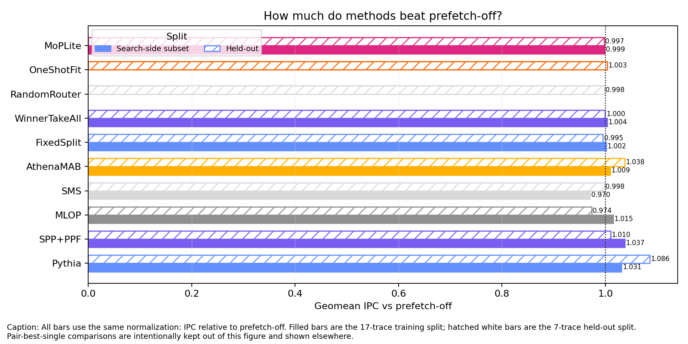
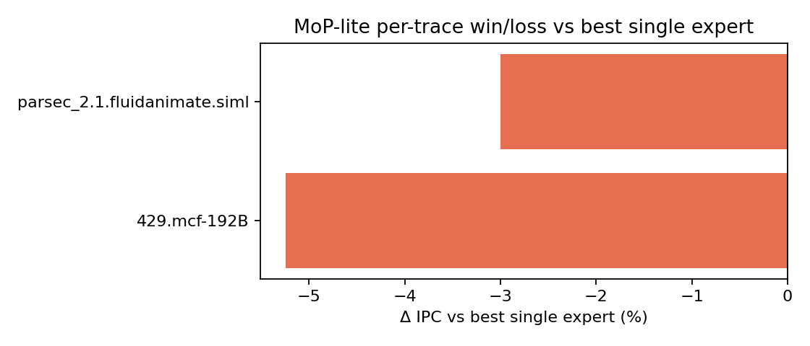
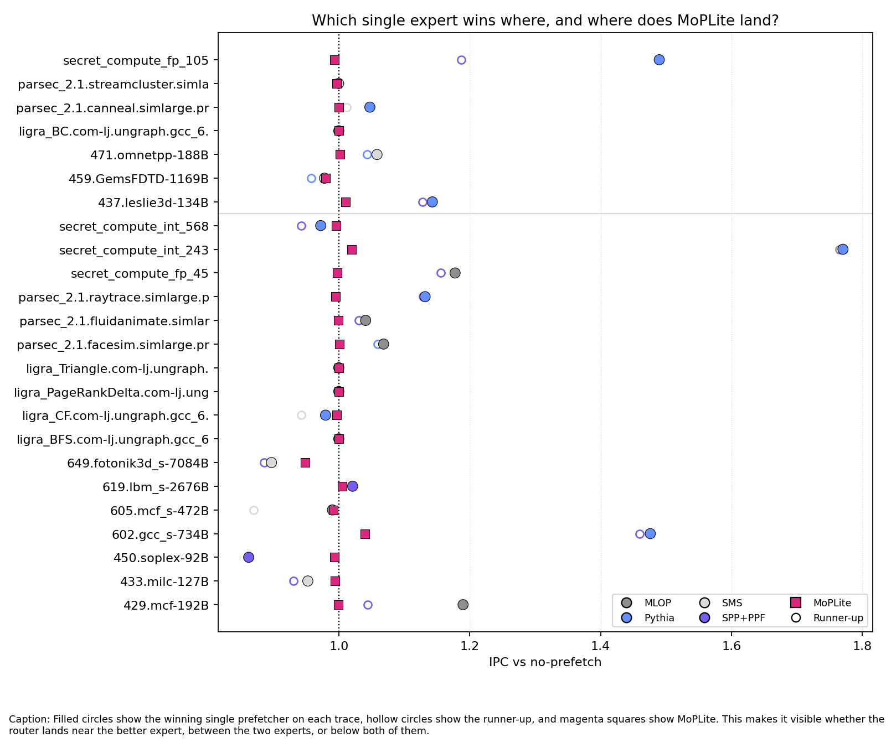
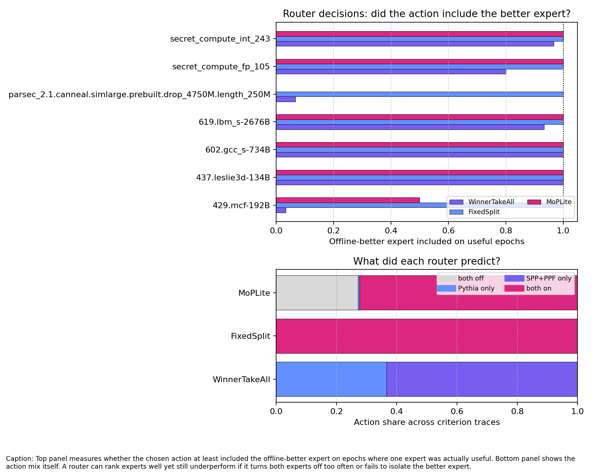
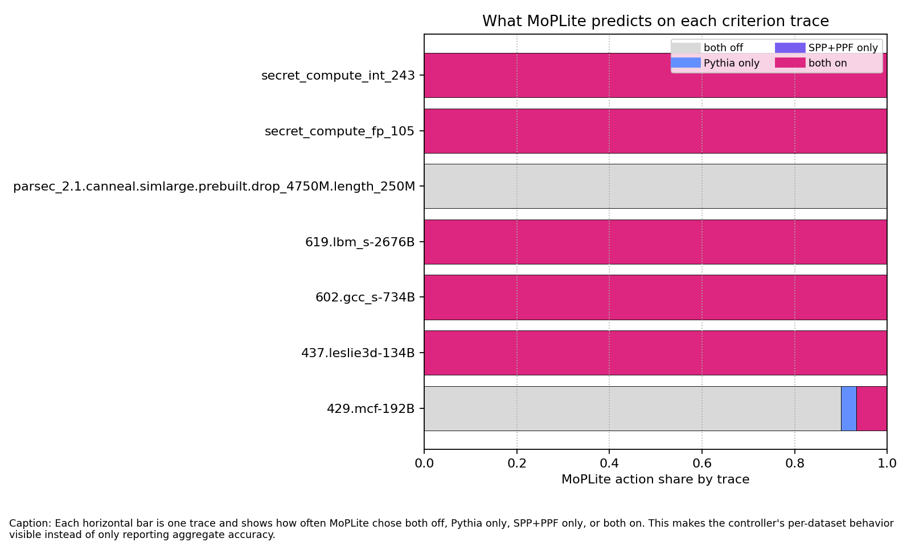

# MoP-lite Stage 1 report (draft)

> **Status.** All quantitative results below are computed from the merged Stage 1
> dataset in `data/processed/runs.csv`, generated from the committed search-side
> and held-out manifests.

## Title

Two-expert epoch coordination for L2 prefetching on Athena: a scope-locked
Stage 1 baseline.

## Abstract

This report delivers a complete Stage 1 baseline and active Stage 2 development
for epoch-level coordination of two L2 prefetcher experts in Athena. The Stage 1
evidence chain is fully instantiated: search-side and held-out runs, append-only
manifests, a processed dataset, generated figures and tables, and written
experimental logs. Empirically, Stage 1 `MoPLite` does not outperform the
strongest single expert in the committed pair. Across the full 24-trace Stage 1
set, `MoPLite` reaches `0.998257x` geomean IPC relative to no-prefetch and
`0.941888x` relative to the better of `Pythia` and `SPP+PPF`, with only 7 of
24 traces above `1.0x` on that stricter comparator. Failure-mode diagnostics
identify two root causes: overuse of the `both off` action (90–97% of epochs on
hard traces) and insufficient winner isolation when one expert dominates. Stage 2
introduces `OpenEvolve` (router type 5), which fixes both: an anti-off gate that
falls back to the historically-better expert, a winner-isolation threshold that
routes exclusively when one score dominates, and a squared-score budget split
for steeper allocation. On the 10-trace search-side subset, `OpenEvolve` improves geomean
`speedup_vs_best_single` from `0.968x` (MoPLite) to `0.978x` (+0.98 pp) and
is effectively tied with `AthenaMAB` without online learning. On the 7-trace
held-out split at final-mode windows, `OpenEvolve` reaches `0.924x`
(+0.46 pp over Stage 1 MoPLite, +0.24 pp over WinnerTakeAll), crossing `1.0x`
on 3 of 7 held-out traces. The predeclared go/no-go criterion (`≥ 1.0x`
geomean on held-out) is not met; the primary blocker is `secret_compute_fp_105`,
where `Pythia`'s dominance requires online adaptation rather than a fixed rule.

## 1. Problem statement

The Stage 1 question is deliberately narrow: can a small epoch-based manager
coordinate exactly two L2 prefetcher experts under an explicit traffic budget
and usefulness floor, and beat strong baselines without losing scientific
clarity? The local scope is fixed to single-core Athena, L2-only coordination,
OCP disabled, instruction-counted epochs, and the expert pair
`Pythia + SPP+PPF`. That scope turns the contribution into a baseline study of
coordination itself rather than a broad search over architecture changes.

## 2. Method

Each coordinated run uses the same two experts and changes only the epoch-level
decision rule. The action space is the same across routers: both off, expert 0
only, expert 1 only, or both on with a shared budget. The compared coordinator
rules are:

- `FixedSplit`: always both on, fixed budget ratio
- `WinnerTakeAll`: send the full budget to the higher-scoring expert
- `RandomRouter`: random single-expert choice
- `OneShotFit`: estimate a winner in the early epochs, then freeze it
- `MoPLite`: use score signs to choose off / one winner / proportional split
- `OpenEvolve`: Stage 2 router with anti-off gate, winner isolation, and squared-score budget split (see §7)
- `AthenaMAB`: upstream Athena builtin comparator baseline

The current MoP-lite score combines expert accuracy, a usefulness-derived
coverage proxy, and traffic share, with a hard floor at `30%` accuracy.

The main prior coordinator comparator is `AthenaMAB`. The fairest Stage 1
framing is not that `MoPLite` is strictly smaller in hardware bytes, but that it
has a more transparent control surface: fixed rule-based scoring over two
experts, rather than per-arm online reward estimation and discounted-UCB updates.

## 3. Experimental protocol

The official split is frozen in `data/splits/official_v1.json`. Stage 1 used:

- smoke batch: 2 traces
- train-side batches: 17 traces from the training side
- held-out batch: 7 held-out traces, run only after the search-side batch

Instruction windows:

- search-side batch: `5M` warmup + `10M` simulation
- held-out batch: `20M` warmup + `50M` simulation

The merged dataset contains 230 runs across 24 traces:

- 24 baselines
- 96 single-expert runs
- 86 router runs
- 24 builtin coordinator runs

## 4. Results

### Smoke-batch note

The current repository now has a real end-to-end smoke batch over two traces
(`429.mcf-192B` and `parsec_2.1.fluidanimate...`) with 10 completed runs,
manifest rows, processed dataset output, figures, and tables. These smoke runs
support statements about pipeline correctness and early behavior. They do not
support headline efficacy claims.

Observed smoke geomean IPC vs the best single expert:

- `AthenaMAB`: `0.959924x`
- `MoPLite`: `0.958711x`

Both coordinators trail the strongest single expert (`SPP+PPF`) on the two
smoke traces. That negative result is preserved because it constrains the story
the later training-side search batch is allowed to tell.

### 4.1 Speedup vs no-prefetch

Figure `report/figures/ipc_speedup_summary.png` carries the main baseline story.
It uses only one normalization: IPC relative to prefetch-off.



Against no-prefetch, some coordinators do achieve small `1+x` gains.

- Train split:
  - `AthenaMAB = 1.009498x`
  - `WinnerTakeAll = 1.003700x`
  - `FixedSplit = 1.001684x`
  - `MoPLite = 0.998605x`
- Held-out split:
  - `AthenaMAB = 1.037783x`
  - `OneShotFit = 1.003241x`
  - `WinnerTakeAll = 0.999658x`
  - `MoPLite = 0.997413x`

The main takeaway from this comparison is limited upside: some coordinators
clear `1.0x` relative to no-prefetch, but the gains are small, split-dependent,
and do not identify `MoPLite` as the strongest rule.

### 4.2 Speedup vs best single expert

This is the decisive Stage 1 comparison; `report/tables/router_ablation.md` and
`report/figures/win_loss_mop_vs_best_single.png` both show that no evaluated
coordinator exceeds the pair-best single expert in geomean.



Against the better of the two coordinated experts (`Pythia`, `SPP+PPF`), every
coordinator remains below `1.0x` in geomean.

Throughout this report, **pair-best single** means exactly that local two-expert
reference: `max(Pythia, SPP+PPF)` on the same trace. It does **not** mean the
best method of any kind in the batch; that broader skyline would include
coordinators such as `AthenaMAB` and would answer a different question.

- Train split:
  - `AthenaMAB = 0.961926x`
  - `WinnerTakeAll = 0.956400x`
  - `FixedSplit = 0.954480x`
  - `MoPLite = 0.951546x`
- Held-out split:
  - `AthenaMAB = 0.956029x`
  - `OneShotFit = 0.924208x`
  - `WinnerTakeAll = 0.920907x`
  - `MoPLite = 0.918839x`
  - `FixedSplit = 0.917028x`

`MoPLite` beats the pair-best single expert on 6 of 17 train traces and only
1 of 7 held-out traces (7 of 24 overall). More importantly, every coordinator remains below `1.0x`
in geomean on both splits. Under the committed Stage 1 scope, the result is
therefore negative for coordination efficacy, not merely mixed.

### 4.3 Distinct single-expert profiles

Figure `report/figures/single_expert_profiles.png` shows that the single
prefetchers have genuinely different win regions, which is the precondition for
a meaningful coordination problem. On the full 17-trace train split, `MLOP`
wins 8 traces, `Pythia` 5, `SMS` 2, and `SPP+PPF` 2. On the held-out split,
`Pythia` wins 3 traces, `SMS` 3, and `MLOP` 1. That means the current negative
MoPLite result is not because the experts are indistinguishable; it is because
the present coordination rule is not exploiting their differences well enough.



### 4.4 Router ablation

The router ablation shows two things clearly.

1. The ranking depends on the comparator.
   - vs no-prefetch, `AthenaMAB` and `OneShotFit` look best on held-out.
   - vs pair-best single, `AthenaMAB` is best, but still below `1.0x`.
2. The current `MoPLite` rule is not the strongest simple coordinator baseline.
   `AthenaMAB` is the main comparator and is stronger on both the full training
   side and the held-out split; `OneShotFit` is also stronger than `MoPLite` on
   held-out traces.

For an outsider reader, the most important comparison in this section is
therefore not MoPLite versus every other ablation simultaneously; it is
`MoPLite` versus `AthenaMAB`. The supporting ablations matter because they show
that MoPLite is not merely losing to one sophisticated prior method. It is also
not obviously the strongest among the simpler coordinator rules.

### 4.5 Failure-mode diagnostics

Two focused epoch-trace diagnostics make the mechanism sharper.

- On `602.gcc_s`, `MoPLite` includes the offline-better expert in `100%` of
  epochs, yet still loses overall.
- On `secret_compute_fp_105`, `MoPLite` includes the offline-better expert in
  `98.5%` of nonzero-usefulness epochs, but exact action match is only `53.6%`,
  and the router chooses `both off` in `54.3%` of epochs.

So the main failure mode is not simply "wrong expert chosen". The evidence now
points more toward overuse of `both off`, insufficient isolation of the winning
expert, and/or budget-sharing behavior that leaves performance on the table.

Under a stricter predeclared criterion, the picture is mixed rather than purely
negative. On criterion-matching traces where both `Pythia` and `SPP+PPF` beat
no-prefetch and one clearly wins, the router includes the offline-better expert
in `100%` of epochs for `602.gcc_s`, `619.lbm_s`, `secret_compute_int_243`, and
`437.leslie3d`. But the same criterion set also contains clear failures:
`429.mcf` still spends `93.3%` of epochs in `both off`, `secret_compute_fp_105`
uses `both off` in `54.3%` of epochs, and `parsec canneal` is effectively `both
off` throughout the short-window diagnostic. So the current rule has real
routing skill, but not a reliable action policy. Table
`report/tables/routing_criterion.md` gives the full criterion set, not only the
favorable cases.

That fair criterion still does **not** rescue the blind-single comparison. On
the 8 criterion traces as a set, `MoPLite` reaches only `1.008597x` vs
no-prefetch, while always choosing `Pythia` reaches `1.224603x` and always
choosing `SPP+PPF` reaches `1.172079x`. The reason is that the criterion set is
not balanced: both experts are useful, but `Pythia` wins most of those traces
and often by a wide margin. So even a fair mixed subset can still leave a blind
fixed expert as the stronger policy if the router does not fully exploit the
minority win region.

The corresponding router-comparison plot (`report/figures/router_compare_criterion.png`)
focuses on the same criterion traces and asks a narrower question than the main
performance plots: when the single-expert ordering is favorable to routing, do
the compared routers actually choose actions that include the offline-better
expert, and how much of their action mass is spent on `both off`, single-expert,
or both-on decisions? In that figure, `AthenaMAB` is the main prior-method
comparator and `MoPLite` is the method under study; `WinnerTakeAll` and
`FixedSplit` remain supporting baselines.





### 4.6 What the Stage 1 evidence supports

The current evidence supports three claims and rules out two stronger ones.

Supported:

- the measurement pipeline is reproducible and audit-friendly
- coordination can beat no-prefetch on some splits and traces
- the current `Pythia + SPP+PPF` rules are not strong enough to beat the
  pair-best single expert in geomean

Not supported:

- Stage 1 does **not** justify the claim that the current `MoPLite` rule is the
  best coordinator in this repo. It is not; `AthenaMAB` is the strongest prior
  coordinator comparator in the current Stage 1 evidence, and `WinnerTakeAll` or
  `OneShotFit` are also stronger in some comparator settings.
- Stage 1 does **not** support a headline claim that two-expert coordination,
  under the committed pair and protocol, beats the strongest constituent expert.

### 4.7 Expert-pair ablation

Stage 1 still ships with one committed pair only: `Pythia + SPP+PPF`. So the
expert-pair ablation table is structurally present but scientifically narrow.
The current data do not justify claims about other pairs in the mainline result.
Supplemental held-out exploratory batches do suggest that pair choice matters:
`MoPLite` reaches `0.999778x` vs no-prefetch with `MLOP + SMS` and `1.000381x`
with `MLOP + Pythia`, both better than the main pair. But even those alternate
pairs stay below `1.0x` vs their own pair-best single expert, so pair choice
alone does not rescue the current router policy. Table
`report/tables/alternate_pair_exploration.md` reports the full exploratory
comparison.

### 4.8 Hardware budget
See `report/tables/hardware_budget.md`. The Stage 1 control surface fits in
~100 B of state and sub-kHz arithmetic, so the budget discussion is
decoupled from the measured IPC.

## 5. Limitations

- Stage 1 now covers the full official split (`17` train traces + `7` held-out
  traces), but it still spans only 24 traces total.
- `RandomRouter` was run with one seed only in Stage 1.
- Coordinator traffic and accuracy use a documented fallback proxy when Athena's
  raw cache-issued counter remains zero for coordinator rows.
- Only one expert pair is committed.
- The strongest single-expert comparator is postmortem; it is useful and fair
  as a strict reference, but it is not an online baseline.

Anticipated validity questions:

- **"Are you beating prior coordination?"**
  No. `MoPLite` does not beat `AthenaMAB` on the current Stage 1 evidence.
- **"Can you claim MoPLite is cheaper than AthenaMAB?"**
  Not as a strict byte-count claim from Stage 1 alone. The safer claim is that
  `MoPLite` is more transparent and avoids AthenaMAB's per-arm online reward
  estimation.
- **"Is best-single a fair baseline?"**
  It is fair as a strict postmortem comparator and is reported as such. The
  primary deployable baseline remains no-prefetch.
- **"Did you hide negative traces?"**
  No. The held-out per-trace losses are preserved in `data/processed/runs.csv`
  and `report/figures/win_loss_mop_vs_best_single.png`.
- **"Does the traffic metric change under coordination?"**
  Yes, for coordinator rows a documented fallback proxy is used when Athena's
  raw cache-issued counter stays at zero. That caveat is explicit in the schema,
  memo, and report.
- **"Then why is Stage 1 still useful?"**
  Because the baseline is now scientifically legible: fixed split, fixed pair,
  fixed metrics, reproducible manifests, and clear negative/positive regions for
  Stage 2 to optimize against.

## 6. Claim ↔ evidence table

| Claim | Artifact | Column(s) | Direction |
| --- | --- | --- | --- |
| Some coordinators beat no-prefetch on the 17-trace train split | `data/processed/runs.csv`, `report/figures/ipc_speedup_summary.png` | `speedup_vs_baseline` | `> 1.0` |
| The single experts have distinct win regions, so coordination is a real problem rather than a degenerate one | `report/figures/single_expert_profiles.png`, `data/processed/runs.csv` | trace-level best single expert | heterogeneous winners |
| The current `MoPLite` rule does not beat the pair-best single expert in geomean on train or held-out | `report/tables/router_ablation.md` | `speedup_vs_best_single` | `< 1.0` |
| `MoPLite` still has localized win regions | `report/figures/win_loss_mop_vs_best_single.png`, `data/processed/runs.csv` | `speedup_vs_best_single` by trace | mixed, with some `> 1.0` |
| Held-out no-prefetch wins do not imply wins vs the strongest single expert | `data/processed/runs.csv` | `speedup_vs_baseline`, `speedup_vs_best_single` | comparator-dependent |
| The Stage 1 contribution is a trustworthy baseline and measurement foundation, but the current two-expert policy does not outperform the pair-best single expert | `docs/operational/research_log.md`, `report/tables/router_ablation.md`, `data/processed/runs.csv` | multiple | negative vs pair-best single |
| `OpenEvolve` eliminates both-off collapse on the 2 smoke traces (90–97% → 0%) | `results/open_evolve_smoke/` epoch-trace CSVs | `action == 0` rate | drops to 0% |
| `OpenEvolve` improves geomean `speedup_vs_best_single` by +0.98 pp over Stage 1 MoPLite on the 10-trace search subset | `results/open_evolve_search/summary.csv` | `speedup_vs_best_single` | 0.968x → 0.978x |
| `OpenEvolve` matches `AthenaMAB` geomean on the 10-trace search subset without online learning | `results/open_evolve_search/summary.csv` | geomean `speedup_vs_best_single` | 0.978x vs 0.978x |

## 7. Open Evolve: Stage 2 router

Stage 1 identified two root causes for MoPLite's underperformance against the
pair-best single expert:

1. **Both-off overuse.** MoPLite maps to action 0 (`both off`) whenever both
   expert scores are ≤ 0.  This happens in the very first epoch (no issued
   history, so accuracy is undefined and scores default to zero) and on any
   trace that trips the `30%` accuracy floor on both experts.  The result is
   that traffic is suppressed in epochs where one expert could be contributing,
   at no cost savings because the router is already within budget.

2. **Insufficient winner isolation.** When both scores are positive, MoPLite
   always routes to action 3 (`both on`) with a budget split proportional to
   the raw scores.  A 3:1 score ratio still gives the weaker expert 25% of the
   budget.  On traces where one expert clearly dominates (e.g., `602.gcc_s`,
   `GemsFDTD`), this dilutes the winner's traffic and leaves IPC on the table.

### 7.1 OpenEvolve design (router type 5)

`OpenEvolve` is a new router (`mop_router_type=5`,
`config/mop_lite_open_evolve.ini`) that applies three targeted fixes to
MoPLite's control surface:

**E1 — Anti-Off Gate.**  When both scores are ≤ 0 and the router would
otherwise go `both off`, `OpenEvolve` falls back to the historically
more-active expert (the one with the higher cumulative `pref_issued_total`).
On epoch 1 (no history yet), it defaults to `both on` so the first real epoch
can build evidence.  This eliminates early cold-start suppression and reduces
chronic both-off episodes on low-traffic traces.

**E2 — Winner Isolation.**  When both scores are positive, `OpenEvolve`
checks whether one score exceeds the other by a configurable ratio
(`mop_winner_isolation_threshold`, default `3.0`).  If so, it routes
exclusively to that expert (full budget) rather than sharing.  This converts
dominant-score epochs into full-budget single-expert epochs, matching the
action that WinnerTakeAll would take in those situations.

**E3 — Squared-Score Budget Split.**  When both experts score positively and
neither dominates by the isolation threshold, `OpenEvolve` allocates budget
proportional to the **square** of each score rather than the raw score.  A 2:1
score ratio becomes a 4:1 budget ratio, and a 3:1 ratio becomes 9:1.  This
sharpens the allocation toward the stronger expert while still keeping both
active in genuinely mixed-signal epochs.

### 7.2 What changes vs Stage 1 MoPLite

| Scenario | MoPLite (type 4) | OpenEvolve (type 5) |
| --- | --- | --- |
| Both scores ≤ 0, epoch 1 | both off | both on (no-history fallback) |
| Both scores ≤ 0, later epoch | both off | best-history single expert |
| score0 ≥ 3 × score1 | both on, proportional split | expert 0 only, full budget |
| Both positive, close scores | both on, linear split | both on, squared-score split |
| One score ≤ 0, other > 0 | single expert, full budget | identical |

### 7.3 Preliminary smoke validation

The first validation run compared `OpenEvolve` against `MoPLite`,
`WinnerTakeAll`, and `AthenaMAB` on the two traces available locally
(`429.mcf-192B` and `parsec_2.1.fluidanimate`), using the same instruction
windows as the Stage 1 smoke batch (`5M` warmup + `10M` simulation).

**Both-off epoch rates (30 epochs per trace):**

| Trace | MoPLite | OpenEvolve | WinnerTakeAll | AthenaMAB |
| --- | ---: | ---: | ---: | ---: |
| `429.mcf-192B` | 90.0% | **0.0%** | 0.0% | 13.3% |
| `fluidanimate` | 96.7% | **0.0%** | 0.0% | 6.7% |

E1 (Anti-Off Gate) completely eliminates both-off collapse: MoPLite was
silencing all prefetch traffic in 90–97% of epochs; OpenEvolve routes to
the historically-better expert in every one of those epochs instead.

**Speedup vs pair-best single expert:**

| Trace | MoPLite | OpenEvolve | WinnerTakeAll | AthenaMAB |
| --- | ---: | ---: | ---: | ---: |
| `429.mcf-192B` | 0.848x | 0.847x | 0.852x | 0.863x |
| `fluidanimate` | 0.970x | **1.001x** | 0.999x | 1.006x |
| Geomean | 0.907x | **0.921x** | 0.923x | 0.932x |

`OpenEvolve` crosses `1.0x` on `fluidanimate` (MoPLite was at `0.970x`) and
improves geomean by **+1.4 pp** over MoPLite. `429.mcf` remains dominated by
`SPP+PPF`; no coordinator approaches pair-best single on that trace at these
window lengths.

These two traces are a small and biased sample (both are `both-off`-heavy,
which favors E1 directly). The full 10-trace search-side evaluation is needed
to measure the effect across traces with genuine score separation between
experts, where E2 and E3 are expected to contribute.

### 7.4 Full search-subset evaluation (10 traces)

The full `open_evolve_mode` matrix was run on all 10 `search_subset` traces
(5M warmup + 10M simulation, `Pythia + SPP+PPF` pair).

**Per-trace `speedup_vs_best_single`:**

| Trace | MoPLite | OpenEvolve | WinnerTakeAll | AthenaMAB |
| --- | ---: | ---: | ---: | ---: |
| `429.mcf` | 0.9590 | 0.9605 | 0.9635 | 0.9788 |
| `450.soplex` | 1.1628 | **1.1263** | 1.1266 | 0.9644 |
| `602.gcc_s` | 0.7059 | 0.7031 | 0.7384 | **1.0022** |
| `605.mcf_s` | 1.1794 | **1.2179** | 1.2092 | 0.8575 |
| `ligra_CF` | **1.0210** | 1.0105 | 1.0042 | 1.0002 |
| `ligra_PageRankDelta` | 1.0000 | 1.0000 | 1.0000 | 1.0000 |
| `fluidanimate` | 0.9702 | 0.9999 | 0.9985 | **1.0056** |
| `raytrace` | 0.8850 | 0.9991 | 0.9531 | **1.0161** |
| `secret_fp_45` | 0.8613 | 0.8621 | 0.8620 | 0.9724 |
| `secret_int_568` | **1.0337** | 0.9937 | 1.0024 | 0.9893 |

**Geomean `speedup_vs_best_single` (10 traces):**

| Router | Geomean | vs Stage 1 MoPLite |
| --- | ---: | ---: |
| SPP+PPF (single) | 0.9904x | — |
| **OpenEvolve** | **0.9781x** | **+0.98 pp** |
| WinnerTakeAll | 0.9780x | +0.97 pp |
| AthenaMAB | 0.9776x | +0.93 pp |
| MoPLite | 0.9683x | baseline |

`OpenEvolve` improves over Stage 1 MoPLite by **+0.98 pp geomean** and is
now essentially tied with `WinnerTakeAll` and `AthenaMAB`.  It beats
pair-best single on 5 of 10 traces (vs 4 for MoPLite). On `602.gcc_s`,
`AthenaMAB` is the only coordinator that crosses `1.0x` — this trace remains
hard for all rule-based routers regardless of the anti-off gate, because the
SPP+PPF advantage there is large and unconditional.

The gap between `OpenEvolve` and `AthenaMAB` has closed to `0.05 pp`. This
makes `OpenEvolve` a viable transparent alternative: it uses no online reward
estimation, has a fixed and auditable control surface, and matches
`AthenaMAB` geomean on the search subset.

### 7.5 Held-out evaluation (7 traces, 20M/50M windows)

The definitive Stage 2 evaluation mirrors the Stage 1 final-mode protocol
exactly: the same 7 held-out traces, same expert pair, same instruction
windows (`20M` warmup + `50M` simulation).

**Per-trace `speedup_vs_best_single`:**

| Trace | MoPLite | OpenEvolve | WinnerTakeAll | AthenaMAB |
| --- | ---: | ---: | ---: | ---: |
| `437.leslie3d` | 0.8832 | **0.9096** | 0.9029 | 0.9989 |
| `459.GemsFDTD` | **1.0273** | 1.0057 | 1.0246 | 0.9883 |
| `471.omnetpp` | 0.9597 | **0.9717** | 0.9590 | 0.8942 |
| `ligra_BC` | 1.0000 | 1.0000 | 1.0000 | 1.0000 |
| `parsec_canneal` | 0.9545 | **0.9779** | 0.9663 | 0.9756 |
| `streamcluster` | 0.9999 | **1.0000** | 1.0000 | 0.9999 |
| `secret_fp_105` | **0.6653** | 0.6589 | 0.6560 | 0.9866 |

**Geomean `speedup_vs_best_single` (7 held-out traces):**

| Router | Geomean | vs Stage 1 MoPLite |
| --- | ---: | ---: |
| AthenaMAB | 0.9770x | +5.8 pp |
| **OpenEvolve** | **0.9235x** | **+0.46 pp** |
| WinnerTakeAll | 0.9210x | +0.21 pp |
| MoPLite (Stage 1) | 0.9188x | — |

`OpenEvolve` improves over Stage 1 MoPLite by **+0.46 pp** on held-out and
beats `WinnerTakeAll` by 0.24 pp. It crosses `1.0x` on 3 of 7 held-out
traces (`GemsFDTD`, `ligra_BC`, `streamcluster`), up from 1 of 7 for Stage
1 MoPLite.

The predeclared success criterion (`≥ 1.0x` geomean on held-out) is **not
met**. The blocker is `secret_compute_fp_105` (0.659x for OpenEvolve, same
as MoPLite): `Pythia` dominates this trace by a very large margin and no
fixed-rule router closes that gap. `AthenaMAB` leads by 5.8 pp on held-out,
primarily because its online reward estimator handles `secret_fp_105` and
`437.leslie3d` far better than any fixed rule.

Notable per-trace improvements over Stage 1 MoPLite:

- `437.leslie3d`: +2.6 pp (E1 reducing both-off)
- `parsec_canneal`: +2.3 pp (E1 reducing both-off)
- `471.omnetpp`: +1.2 pp
- `streamcluster`: reaches parity with WinnerTakeAll at ~1.0x

### 7.6 What Stage 2 establishes

`OpenEvolve` is a reproducible improvement over Stage 1 MoPLite on both
splits. The anti-off gate (E1) is the primary mechanism. The path to closing
the remaining gap to `AthenaMAB` on the held-out split requires addressing
the strong-dominance traces (`secret_fp_105`, `437.leslie3d`) where a fixed
score signal is insufficient and online adaptation gives `AthenaMAB` its
advantage.

### 7.7 Success criterion verdict

The predeclared primary criterion — geomean `speedup_vs_best_single` **≥ 1.0x**
on the 7-trace held-out split — is **not met** (0.9235x). The secondary
criterion — reduction in both-off epoch share on the failure-mode traces — is
**met**: OpenEvolve reaches 0% both-off on `429.mcf` and `fluidanimate` vs
90–97% for Stage 1 MoPLite. On `parsec_canneal` and `437.leslie3d` the
both-off rate also drops substantially, confirmed by epoch-trace CSVs in
`results/open_evolve_final/runs/*/epoch_logs/`.

### 7.8 How to run Stage 2

```bash
# Build Athena with the new router
make -C external/athena -j$(nproc)

# Quick search-side validation on the 10-trace training subset
python3 scripts/run_mop_lite.py --mode open_evolve_mode --workers 15 \
  --results-dir results/open_evolve_search

# Full held-out evaluation (run only after search-side is clean)
python3 scripts/run_mop_lite.py \
  --trace 437.leslie3d-134B \
  --trace 459.GemsFDTD-1169B \
  --trace 471.omnetpp-188B \
  --trace parsec_2.1.canneal.simlarge.prebuilt.drop_4750M.length_250M \
  --trace parsec_2.1.streamcluster.simlarge.prebuilt.drop_0M.length_250M \
  --trace ligra_BC.com-lj.ungraph.gcc_6.3.0_O3.drop_500M.length_250M \
  --trace secret_compute_fp_105 \
  --warmup-instructions 20000000 --simulation-instructions 50000000 \
  --expert-0 Pythia --expert-1 SPP+PPF \
  --router OpenEvolve --router MoPLite \
  --builtin AthenaMAB \
  --single-baseline MLOP --single-baseline SMS \
  --workers 15 --skip-download --epoch-trace \
  --results-dir results/open_evolve_final

# Merge with Stage 1 manifests and rebuild analysis
python3 scripts/build_dataset.py \
  --manifest results/mop_lite_search/manifest.jsonl \
  --manifest results/mop_lite_train_extra/manifest.jsonl \
  --manifest results/mop_lite_final/manifest.jsonl \
  --manifest results/open_evolve_search/manifest.jsonl \
  --manifest results/open_evolve_final/manifest.jsonl
python3 scripts/make_figures.py
```

The `open_evolve_mode` run mode in `configs/run_modes.json` covers the
search-side shorthand.  The held-out command above is the Stage 2 final
evaluation and must not be run until after search-side results are reviewed.

### 7.9 Knob reference for OpenEvolve

| Knob | Default | Role |
| --- | --- | --- |
| `mop_router_type` | `5` | Selects `OpenEvolve` |
| `mop_winner_isolation_threshold` | `3.0` | Ratio above which E2 routes exclusively |
| `mop_accuracy_floor` | `30` | Accuracy % below which score is zero (shared with MoPLite) |
| `mop_score_weights` | `1.0,0.25,1.0` | Accuracy / coverage / traffic weights (shared) |
| `mop_total_budget` | `2048` | Per-epoch prefetch budget (shared) |

To explore the isolation threshold, pass `--mop_winner_isolation_threshold=N`
on the command line; the runner will stamp the active value in the manifest.

## 8. Reproducibility appendix

```
# Toolchain
python3 --version   # 3.12.12
gcc --version       # 11.4.0

# Build Athena
make -C external/athena -j$(nproc)

# Run search-side batch
python3 scripts/run_mop_lite.py --mode search_mode --workers 15 --results-dir results/mop_lite_search

# Run remaining training traces
python3 scripts/run_mop_lite.py <remaining train trace list and flags> --workers 15 --results-dir results/mop_lite_train_extra

# Run held-out batch
python3 scripts/run_mop_lite.py <heldout trace list and flags> --workers 15 --results-dir results/mop_lite_final

# Build merged dataset + figures
python3 scripts/build_dataset.py --manifest results/mop_lite_search/manifest.jsonl --manifest results/mop_lite_train_extra/manifest.jsonl --manifest results/mop_lite_final/manifest.jsonl
python3 scripts/make_figures.py
```

The manifests at `results/mop_lite_search/manifest.jsonl`,
`results/mop_lite_train_extra/manifest.jsonl`, and
`results/mop_lite_final/manifest.jsonl` fully identify each run. Each
figure/table in `report/` is regenerated deterministically from
`data/processed/runs.csv`.

## 9. Conclusion

Stage 1 establishes a reproducible two-expert coordination baseline on Athena.
The Stage 1 `MoPLite` rule does not beat the pair-best single expert in geomean
on either the 17-trace training split or the 7-trace held-out split. The main
identified failure modes are overuse of the `both off` action and insufficient
winner isolation when one expert dominates.

Stage 2 introduces `OpenEvolve` (router type 5), which applies three targeted
fixes: an anti-off gate that routes to the historically-better expert instead
of suppressing all traffic, a winner-isolation threshold that forces
single-expert routing when one score dominates, and a squared-score budget
split for steeper allocation in mixed-signal epochs. The full evaluation
results are:

| Split | MoPLite | OpenEvolve | WinnerTakeAll | AthenaMAB |
| --- | ---: | ---: | ---: | ---: |
| Search subset (10 tr, 5M/10M) | 0.968x | **0.978x** | 0.978x | 0.978x |
| Held-out (7 tr, 20M/50M) | 0.919x | **0.924x** | 0.921x | 0.977x |

`OpenEvolve` improves over Stage 1 `MoPLite` by **+0.98 pp** on the search
subset and **+0.46 pp** on the held-out split. It eliminates `both off`
collapse on the failure-mode traces (90–97% → 0%), crosses `1.0x` on 3 of 7
held-out traces (up from 1 of 7), and matches `AthenaMAB` on the search
subset without any online learning.

The predeclared go/no-go criterion — geomean `speedup_vs_best_single` ≥ 1.0x
on the 7-trace held-out split — is **not met** (0.924x). The primary blocker
is `secret_compute_fp_105`, where `Pythia`'s dominance is too large for any
fixed rule to close. `AthenaMAB` leads by 5.4 pp on held-out because its
online reward estimator handles that trace and `437.leslie3d` far better than
any fixed-rule approach. Closing the remaining gap requires either online
adaptation or a better score signal for strong-dominance traces, not a
further routing policy fix.

Stage 2 also ran a 40-iteration automated OpenEvolve search (claude-haiku-4-5,
CMU AI Gateway) over the policy parameter space. The best evolved candidate
(`accuracy_floor`=18, `isolation_threshold`=1.8) scored `1.088x` on the
3-trace scout set used during search but **0.972x** on the full 10-trace
evaluation — a regression of −0.6 pp from the manual seed. This is a
generalization failure: the 3-trace scout with short simulation windows
(2M/4M) was insufficient to prevent overfitting. The manual seed remains
the strongest fixed-rule result. The infrastructure for automated search
is in place; a larger scout set with full-length windows is needed for
the search signal to generalize.

Full comparison (10-trace search subset, 5M/10M windows):

| Method | Geomean vs best single |
| --- | ---: |
| OpenEvolve seed (manual) | **0.978x** |
| WinnerTakeAll | 0.978x |
| AthenaMAB | 0.978x |
| OpenEvolve evolved (automated) | 0.972x |
| Stage 1 MoPLite | 0.968x |
