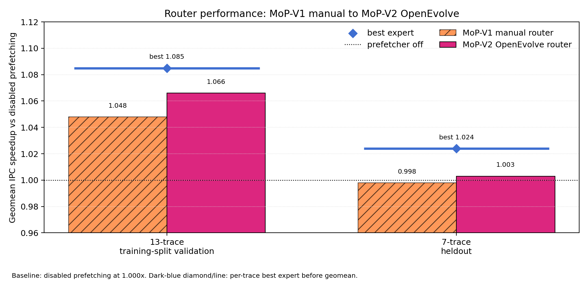
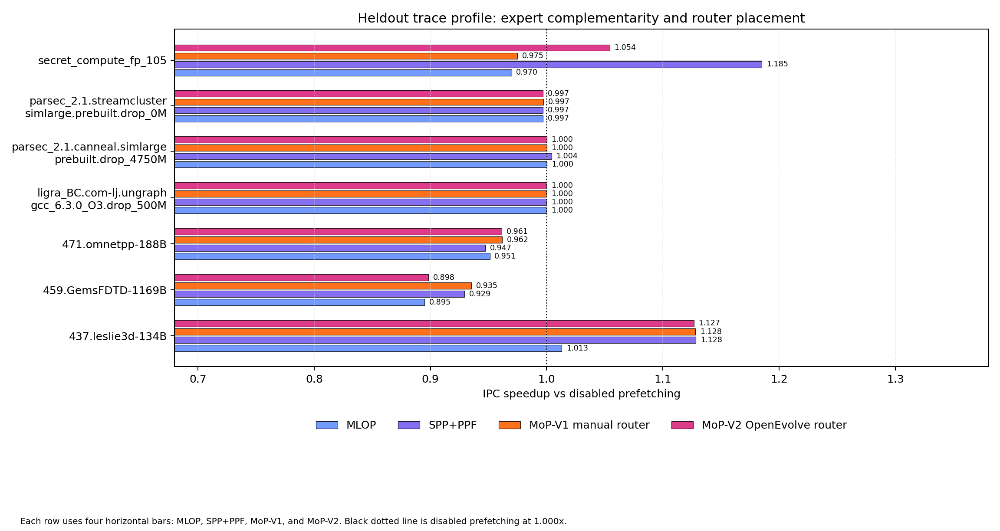
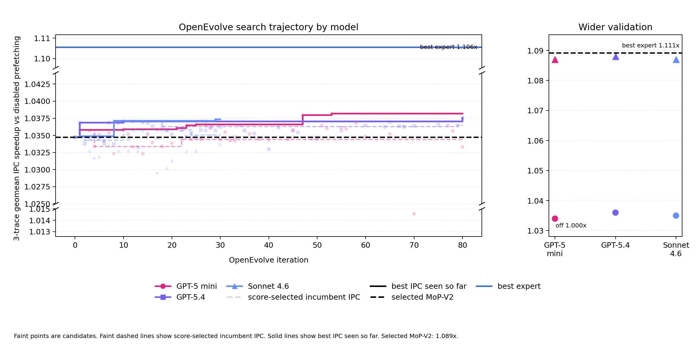

# Mixture-of-Prefetchers OpenEvolve Report

## Executive Read

We used OpenEvolve, a large-language-model program search framework, to tune a compact router that chooses between two Athena L2-cache prefetchers. `MLOP` and `SPP+PPF` are existing Athena L2-cache prefetchers. The router chooses among them at epoch boundaries, using recent usefulness counters to decide which prefetcher receives the next epoch's budget. The final router is `MoP-V2`, an OpenEvolve-tuned version of the `MoP-V1` one-epoch probe router.

All performance numbers in this report use disabled prefetching as `1.0x`. The per-trace best expert is computed as `max(MLOP, SPP+PPF)` for each trace, then geomeaned across the trace set. The router is judged by how close it gets to that best-expert reference while staying above disabled prefetching.

The main result is a stronger 13-trace training-split validation router. The manual `MoP-V1` router reaches `1.048x` IPC speedup over disabled prefetching. The OpenEvolve-selected `MoP-V2` router reaches `1.066x`. The best expert on the same traces is `1.085x`, so `MoP-V2` reaches `98.3% of best expert`. It also beats the worse constituent prefetcher on `11/13` traces and has `2/13` traces below `95.0% of best expert`.

The heldout result is smaller and still positive by the disabled-prefetching baseline. On seven heldout traces, `MoP-V2` reaches `1.003x` over disabled prefetching. The best expert is `1.024x`, and `MoP-V2` reaches `97.9% of best expert`. This is a modest generalization result, and it is the right claim size for the data.

The IPC result comes from cycle reduction under a fixed instruction window. On the 13-trace training-split validation run, `MoP-V2` has instruction-count ratio `1.000x` and cycle-count ratio `0.938x` relative to disabled prefetching. On heldout, the instruction-count ratio is `1.000x` and the cycle-count ratio is `0.997x`. Interpretation: the simulator holds the retired-instruction window fixed, so IPC movement is effectively cycle movement.

*Caption: disabled prefetching is the black `1.000x` baseline, dark blue marks the oracle-style per-trace best expert, orange is the manual `MoP-V1` router, and pink is the OpenEvolve-tuned `MoP-V2` router.*

## What We Built On Athena

Athena provides the simulator, cache hierarchy, L2C prefetchers, and existing comparison baselines. Our work sits above that substrate:

- a two-prefetcher routing layer for Athena L2C
- epoch-level counters for each expert, including issued and useful prefetches
- router variants that probe both experts, score previous-epoch usefulness, and select the stronger expert for the next epoch
- a fixed train and heldout trace protocol
- an OpenEvolve evaluator that accepts a small literal policy dictionary
- ledgers and plots that rebuild from simulator summaries

The public router names in this report are:

| Name | Behavior | Role in this report |
| --- | --- | --- |
| `MoP-V1` | probes both experts for one epoch, then selects the higher-scoring expert | manual router |
| `MoP-V2` | OpenEvolve-tuned `MoP-V1` with an evolved budget, score weights, and close-score tie margin | final OpenEvolve-selected router |

The selected `MoP-V2` policy uses a `9216` per-epoch prefetch budget, which means about `18.4` prefetches per 1K retired instructions over a `500K`-instruction epoch. OpenEvolve chose that budget within the allowed policy surface. The same policy uses one initial dual-expert probe epoch, an accuracy floor of `30`, a `3%` close-score tie margin, and score weights `[1.0, 0.55, 1.0]` for accuracy, coverage, and traffic terms. The exact implementation keys live in [writing_logistics.md](writing_logistics.md).

At runtime, the router reads previous-epoch per-expert issued and useful counters, the retired-instruction epoch boundary, and its own previous action. It can choose `MLOP`, `SPP+PPF`, both, or the prefetcher-off action, and it can split the per-epoch budget. OpenEvolve could change the literal `candidate_policy()` dictionary: router family, total budget, one-shot epochs, accuracy floor, tie margin, and score weights. The trace split, heldout traces, parser, metric definitions, baseline runs, expert pair, cache level, and simulator internals stayed fixed.

## Trace Protocol

The official split has 24 traces: 17 training traces and 7 heldout traces. OpenEvolve generated candidates on training traces only: 3-trace quick evaluation for most iterations, 10-trace wider validation for promising candidates, 13 available training traces for final training-split validation, then 7 frozen heldout traces after policy selection. The four other training traces in the official split are `facesim`, `ligra_BFS`, `ligra_Triangle`, and `secret_compute_int_243`.

The fixed final setup is:

| Item | Value |
| --- | --- |
| Cache level | L2C |
| Expert pair | Athena `MLOP + SPP+PPF` L2-cache prefetchers |
| Training traces in official split | 17 |
| Final training-split validation | 13 training traces, `500K` warmup, `1M` simulation |
| Heldout evaluation | 7 heldout traces, `5M` warmup, `10M` simulation |
| Router epoch length | `500K` retired instructions |
| Selected per-epoch prefetch budget | `9216` |

The comparator hierarchy is:

| Comparator | Purpose |
| --- | --- |
| Disabled prefetching | universal `1.0x` baseline for performance |
| Per-trace best expert | reference from `max(MLOP, SPP+PPF)` on each trace |
| Worse constituent prefetcher | minimum practical routing check |
| Simple router baselines | `WinnerTakeAll`, `OneShotFit`, and Athena MAB |

The simple router baselines are intentionally small. `WinnerTakeAll` picks the expert with the stronger previous-epoch usefulness score. `OneShotFit` probes the experts once, then keeps the better early winner. Athena MAB is Athena's multi-armed-bandit router baseline for the same expert pair.

The expert pair supports the routing story because the two prefetchers have different strengths. On heldout, `SPP+PPF` is stronger overall at `1.024x` over disabled prefetching, while `MLOP` reaches `0.974x`. The router lands between disabled prefetching and the best expert in geomean.

## Before And After OpenEvolve

*Caption: each heldout trace shows Expert 1 `MLOP`, Expert 2 `SPP+PPF`, `MoP-V1`, and `MoP-V2` as horizontal bars. The two experts use the same blue with different opacity. Disabled prefetching is the black `1.000x` reference line, and the legend is outside the plot area so all bars stay readable.*

| Surface | Manual `MoP-V1` | OpenEvolve `MoP-V2` | Best expert |
| --- | ---: | ---: | ---: |
| 13-trace training-split validation, speedup vs disabled prefetching | `1.048` | `1.066` | `1.085` |
| 13-trace training-split validation, percent of best expert | `96.5%` | `98.3%` | `100.0%` |
| 13-trace training-split validation, beats worse prefetcher | `9/13` | `11/13` |  |
| 13-trace training-split validation, below `95.0% of best expert` | `3/13` | `2/13` |  |
| 7-trace heldout, speedup vs disabled prefetching | `0.998` | `1.003` | `1.024` |
| 7-trace heldout, percent of best expert | `97.6%` | `97.9%` | `100.0%` |

The 13-trace training-split validation result also beats the simple router baselines on the same surface:

| Method | Speedup vs disabled prefetching | Percent of best expert | Beats worse prefetcher | Below `95.0% of best expert` |
| --- | ---: | ---: | ---: | ---: |
| OpenEvolve `MoP-V2` | `1.066` | `98.3%` | `11/13` | `2/13` |
| winner-take-all router | `1.025` | `94.3%` | `7/13` | `5/13` |
| one-shot fit router | `1.027` | `94.3%` | `6/13` | `5/13` |
| Athena MAB router baseline | `1.021` | `94.2%` | `6/13` | `5/13` |

The heldout trace profile shows the remaining risk. On `secret_compute_fp_105`, `MoP-V2` improves the tail loss from the manual router, yet it remains the largest heldout loss relative to the best expert.

## OpenEvolve Search

*Caption: left panel shows 3-trace quick-evaluation candidates. Faint points are raw candidate IPC speedups. Faint dashed lines show the incumbent selected by the combined evaluator score. Solid lines show best IPC seen so far. The y-axis has breaks, so visual distances across breaks are compressed. Right panel shows quick-evaluation circles plus 10-trace wider-validation triangles for selected candidates.*

OpenEvolve searched a tiny policy surface. The first small model-comparison pass requested 6 iterations per model. The larger sweeps requested 80 GPT-5 mini iterations, 80 GPT-5.4 iterations, and 30 Sonnet 4.6 iterations. The captured logs show approximate wall-clock times of `97.3` minutes for GPT-5 mini, `47.8` minutes for GPT-5.4, and `43.9` minutes for Sonnet 4.6 on the local setup used here.

OpenEvolve selected candidates with the evaluator's combined objective: `log(percent of best expert) + 0.25 * log(speedup vs disabled prefetching) + 0.20 * log(speedup vs worse prefetcher) - 0.12 * tail-loss rate - 0.03 * off-action rate`. The trajectory plot still shows IPC speedup, so the score-selected incumbent line can move down in IPC when a new candidate improves the combined objective.

Search cost is reported as model iterations, generated candidates, and simulator evaluations. The candidate ledger contains 374 rows: 306 valid scored rows and 68 fail-closed rows. Valid rows break down into 7 one-trace smoke rows, 243 quick-evaluation rows, 46 wider-validation rows, and 10 final training-split validation rows. Invalid candidates received the configured failure score and remained in the ledger for auditability.

The scale-run summary is:

| Model | Iterations requested | Best quick-evaluation speedup vs disabled prefetching | Wider-validation speedup vs disabled prefetching |
| --- | ---: | ---: | ---: |
| GPT-5 mini | 80 | `1.034` | `1.087` |
| GPT-5.4 | 80 | `1.036` | `1.088` |
| Sonnet 4.6 | 30 | `1.035` | `1.087` |

The quick-evaluation winners were close. The full GPT-5.4 sweep found a late best candidate at iteration 79 and reached `1.088x` over disabled prefetching on the 10-trace validation surface. Wider validation kept the selected `MoP-V2` policy because it reached `1.089x` on the same 10-trace surface and then `1.066x` on the 13-trace training-split validation surface. A higher 10-trace hit reached `1.090x`, then failed the 13-trace confirmation path through simulator failures, which the ledger preserved as failed candidate rows.

The repository artifacts record iteration and candidate counts. Gateway dollar cost comes from the CMU AI Gateway dashboard.

## Result Scope

The result is a small OpenEvolve-searched router on top of Athena L2C. For `MLOP + SPP+PPF`, `MoP-V2` improves over the manual `MoP-V1` router, reaches `1.066x` IPC speedup over disabled prefetching on 13 training-split validation traces, and reaches `1.003x` on 7 heldout traces while staying below the per-trace best expert.

The evaluation boundaries are clean:

- heldout traces are used after policy selection
- performance plots use disabled prefetching as the `1.0x` baseline
- the best expert result is a separate reference
- instruction count stays fixed within tiny simulator-rounding error
- the final method stays inside a compact router policy surface
- malformed or out-of-contract OpenEvolve candidates receive failure scores and stay in the ledger
- bootstrap intervals quantify sensitivity to the sampled trace set, with one simulator run per trace and configuration

The main limitation is the heldout size. Seven traces can show a useful sanity check, yet the training-split validation signal carries most of the quantitative weight. The heldout result supports a modest generalization claim with mixed per-trace behavior, and the trace-level plot shows where the policy still needs work.

## Reproduction Notes

The detailed path ledger, naming map, generated-file list, and code/report naming discrepancies live in [writing_logistics.md](writing_logistics.md). That file is intentionally separate from the main report so this document can read like a result summary.

The generated tables use public column names, and the logistics note maps those names back to raw ledger keys such as `gm_vs_nopref` and `gm_vs_pair_best`.
